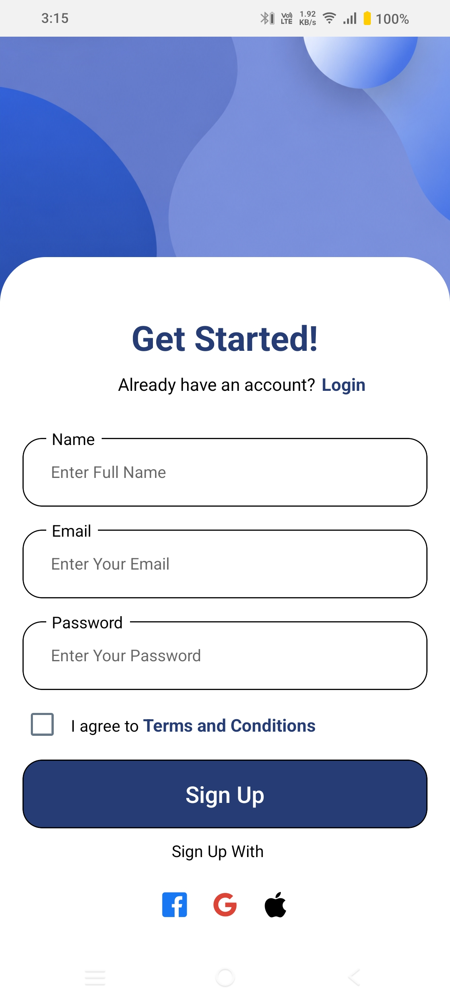

# React Native Signup UI

Modern signup screen built with React Native and Expo.

## Screenshot



## Features

- Floating label inputs
- Reusable input components
- Social login section
- Clean modern UI
- Expo based project

## Run Locally

Clone the project

```bash
git cloneh ttps://github.com/Samratcodebase/ReactNativeSignUpScreen.git

Go to the project directory

cd <your-project-folder>

Install dependencies

npm install

Start the Expo development server

npx expo start
```
